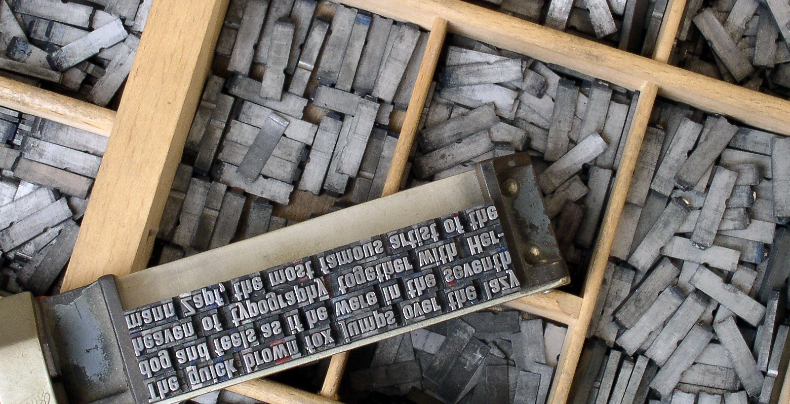

# Leadtype

<p align="center">
  
</p>

<p align="center"><em>Leadtype draws inspiration from traditional typesetting while providing a modern Go toolkit for LTML and PDF generation.</em></p>

Leadtype is a Go toolkit for generating PDF documents, working with AFM and TrueType fonts, composing rich text, and rendering LTML documents into finished pages.

It is organized as a library-first project with small command-line tools and runnable samples. If you want to build PDFs directly from Go, inspect and load fonts, or render XML-driven document layouts, this repository gives you the core pieces in one place.

## Highlights

- Generate PDFs from Go with a low-level writer and higher-level page helpers.
- Use built-in AFM fonts or load TrueType and TrueType Collection fonts.
- Render rich text with font styling, color, underline, and mixed formatting.
- Render LTML, an XML-based document and layout language built on the PDF stack.
- Use modern Unicode Type 0 / CIDFont output for TrueType fonts, including multi-script text and `ToUnicode` maps.
- Explore working examples under [`samples/`](samples/) and focused CLI tools under [`cmd/`](cmd/).

## Status

Leadtype is under active development and is approaching release quality. The codebase is already broadly usable, with solid package-level test coverage and a growing set of end-to-end samples.

## Quick Start

Leadtype requires Go 1.21+.

Clone the repository:

```bash
git clone https://github.com/rowland/leadtype.git
cd leadtype
```

### Try LTML First

LTML is one of the most distinctive parts of the project: an XML-based document and layout language that renders through Leadtype's PDF engine.

Render one of the checked-in LTML samples:

```bash
go run ./cmd/render-ltml -o /tmp/hello-ltml.pdf ltml/samples/test_003_hello_world.ltml
go run ./cmd/render-ltml -o /tmp/rich-text.pdf ltml/samples/test_010_rich_text.ltml
go run ./cmd/render-ltml -o /tmp/cjk-thai-grid.pdf ltml/samples/test_012_cjk_thai_grid.ltml
```

There are 32 LTML sample documents under [`ltml/samples/`](ltml/samples/), covering basic pages, flow and box layout, tables, rich text, images, transforms, overflow behavior, encodings, and more.

### Run the Go Samples

Leadtype also includes Go-based samples that exercise the lower-level PDF and font APIs directly:

```bash
go run ./samples -list
go run ./samples test_003_hello_world
go run ./samples test_009_unicode_ttf
```

Run the standard project checks:

```bash
go build ./...
go test ./...
```

Some samples depend on fonts available on the local machine, especially when using `ttf_fonts.NewFromSystemFonts()`.

## Library Example

This example creates a simple PDF using a built-in AFM font and writes it to disk:

```go
package main

import (
	"os"

	"github.com/rowland/leadtype/afm_fonts"
	"github.com/rowland/leadtype/options"
	"github.com/rowland/leadtype/pdf"
)

func main() {
	out, err := os.Create("hello.pdf")
	if err != nil {
		panic(err)
	}
	defer out.Close()

	doc := pdf.NewDocWriter()

	afm, err := afm_fonts.Default()
	if err != nil {
		panic(err)
	}
	doc.AddFontSource(afm)

	doc.NewPage()
	doc.SetUnits("in")

	if _, err := doc.SetFont("Helvetica", 12, options.Options{}); err != nil {
		panic(err)
	}

	doc.MoveTo(1, 1)
	doc.Print("Hello, Leadtype!")

	if _, err := doc.WriteTo(out); err != nil {
		panic(err)
	}
}
```

For more involved examples, see [`samples/test_003_hello_world.go`](samples/test_003_hello_world.go), [`samples/test_006_rich_text.go`](samples/test_006_rich_text.go), and [`samples/test_009_unicode_ttf.go`](samples/test_009_unicode_ttf.go).

If you want to start from LTML instead of Go code, browse [`ltml/samples/`](ltml/samples/) and render them with [`cmd/render-ltml`](cmd/render-ltml).

## Command-Line Tools

Leadtype includes a few focused utilities:

- [`cmd/render-ltml`](cmd/render-ltml): render an LTML document to PDF locally or submit it to a remote render service.
- [`cmd/serve-ltml`](cmd/serve-ltml): run an HTTP service that accepts LTML plus uploaded assets and returns PDFs.
- [`ttdump/`](ttdump/): inspect TrueType font metadata.

You can run them from the repository:

```bash
go run ./cmd/render-ltml -h
go run ./cmd/serve-ltml -h
go run ./ttdump -h
```

Or install them:

```bash
go install github.com/rowland/leadtype/cmd/render-ltml@latest
go install github.com/rowland/leadtype/cmd/serve-ltml@latest
go install github.com/rowland/leadtype/ttdump@latest
```

## Project Layout

- [`pdf/`](pdf/): core PDF writer, document model, pages, text, images, and font embedding.
- [`font/`](font/): shared font abstraction used by AFM and TTF paths.
- [`ttf/`](ttf/): TrueType parsing, metrics, cmap handling, and subsetting support.
- [`ttf_fonts/`](ttf_fonts/): load fonts from the filesystem or standard system font directories.
- [`afm/`](afm/) and [`afm_fonts/`](afm_fonts/): Adobe Font Metrics support and bundled AFM font data.
- [`rich_text/`](rich_text/): rich-text composition helpers for mixed styles.
- [`ltml/`](ltml/): XML-based document, widget, and layout layer on top of the PDF engine.
- [`codepage/`](codepage/), [`colors/`](colors/), [`options/`](options/), [`wordbreaking/`](wordbreaking/): supporting utilities used across the stack.
- [`samples/`](samples/): runnable examples that generate PDFs.
- [`docs/`](docs/): development notes and Unicode rendering design documents.

## Documentation

- [`samples/README.md`](samples/README.md): how to list and run the included examples.
- [`cmd/render-ltml/README.md`](cmd/render-ltml/README.md): local and remote LTML rendering CLI usage.
- [`cmd/serve-ltml/README.md`](cmd/serve-ltml/README.md): HTTP rendering service API and configuration.
- [`docs/development-process.md`](docs/development-process.md): workflow, testing strategy, and fixture guidance.
- [`docs/unicode-pdf-rendering.md`](docs/unicode-pdf-rendering.md): design overview for Unicode and composite-font PDF output.
- [`docs/unicode-pdf-rendering-todo.md`](docs/unicode-pdf-rendering-todo.md): implementation checklist for the Unicode workstream.

## Contributing

For most changes, the expected baseline is:

```bash
go build ./...
go test ./...
```

Small, reviewable changes are preferred, and package-level tests are the norm throughout the repository.

## Image Credits

The README banner is adapted from [Metal movable type](https://commons.wikimedia.org/wiki/File:Metal_movable_type.jpg) by Willi Heidelbach via Wikimedia Commons, licensed under [CC BY 2.5](https://creativecommons.org/licenses/by/2.5/). The repository copy is cropped from the original. See [`docs/assets/ATTRIBUTION.md`](docs/assets/ATTRIBUTION.md) for details.
